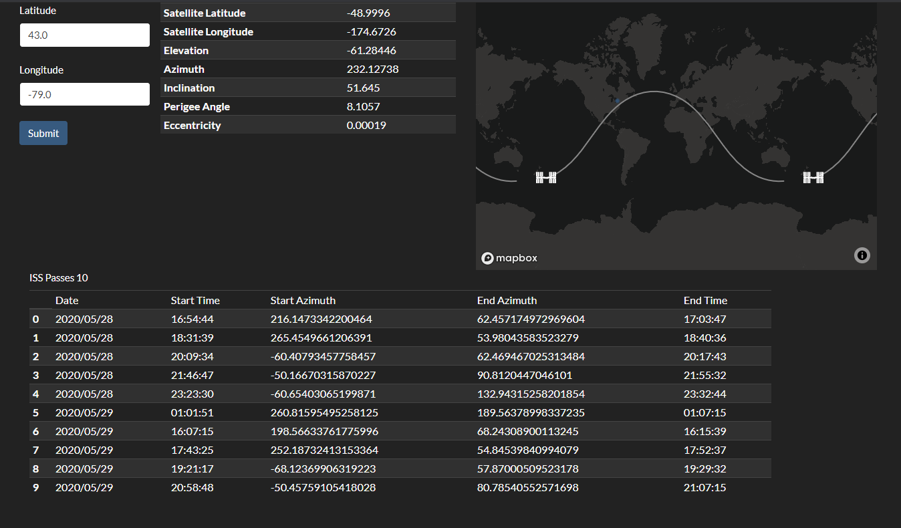

# ISS_Tracker
Provides a graphical representation of the orbit of the International Space Station. Uses mapbox to display results. Calculations are preformed using two line element set data to provide the future location of the satellite as it orbits the earth. Calculations are also done to provide azimth, and elevation angles based on an observer anywhere on earth.

